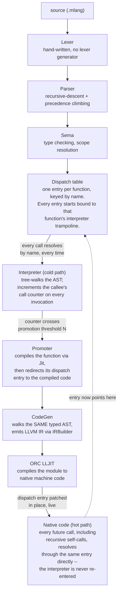

# Architecture: tiered execution

mlang is not "compile everything, then run it" (the Kaleidoscope-tutorial
shape). It's **tiered**, the way V8, HotSpot, and LuaJIT actually work:
every function starts running through a tree-walking interpreter; a
function that gets called often is promoted, live and mid-program, to
JIT-compiled native code. This document describes that pipeline. For the
language itself (syntax, types, semantics), see
[`language-reference.md`](language-reference.md).

## Why tiered, not one-shot

A batch compiler (Kaleidoscope, most "toy language" tutorials) compiles
the whole program once, up front, then runs the result. That's simple, but
it means every function pays compilation cost even if it runs once, and
the compiler never gets to use runtime information (which functions are
actually hot) to decide where optimization effort is worth spending.

Production JITs don't work that way. V8 starts every JavaScript function
in Ignition (a bytecode interpreter), promotes hot functions to Sparkplug
and then to the optimizing TurboFan compiler as they prove themselves hot.
HotSpot starts Java methods in its bytecode interpreter (C1), promoting to
C2 as call/loop counters cross thresholds. LuaJIT interprets by default
and traces hot loops into compiled code. The shared idea: **start cheap,
measure, compile only what's worth compiling, and swap the implementation
underneath already-running code without restarting anything.**

mlang mirrors that shape end to end, deliberately scaled down: one tier of
interpretation, one tier of native code, a single call-count threshold
instead of multiple tiers/back-off heuristics, and no on-stack replacement
(a hot loop inside a function that's only ever called once won't promote
mid-loop -- see [Known limitations](#known-limitations)). What's real is
the mechanism: an indirect dispatch table that gets patched live,
mid-program, while other calls to the same function may already be in
flight.

## Pipeline



## The pieces, and where they live

| Component | Header | What it owns |
|---|---|---|
| Lexer | `include/mlang/lexer/Lexer.h` | Source text → token stream |
| Parser | `include/mlang/parser/Parser.h` | Tokens → AST (recursive descent, precedence climbing for expressions) |
| Sema | `include/mlang/sema/Sema.h` | AST → type-checked AST (or diagnostics); scope resolution mirrors the interpreter's exactly |
| Interpreter | `include/mlang/interpreter/Interpreter.h` | Tree-walks the AST directly; also the correctness oracle every codegen/JIT result is checked against |
| DispatchTable | `include/mlang/jit/DispatchTable.h` | One entry per function: a call counter plus a redirectable trampoline. The whole mechanism this document is about lives here. |
| CodeGen | `include/mlang/codegen/CodeGen.h` | Walks the same typed AST Interpreter does, emits LLVM IR via `IRBuilder` -- unchanged by tiering; it's the same codegen a one-shot compiler would use |
| Jit | `include/mlang/jit/Jit.h` | Wraps LLVM's ORC `LLJIT`. Compiles the whole program lazily (once, on first promotion) and hands back per-function native entry points |
| Promoter | `include/mlang/jit/Promoter.h` | The policy: watches call counts via a hook on DispatchTable, decides when to promote, calls Jit, redirects the entry |
| Repl | `include/mlang/jit/Repl.h` | Feeds statements into the same Interpreter/DispatchTable/Promoter pipeline one line at a time instead of via a whole file |

## How a call resolves

Every call in mlang -- whether it's `main` calling `fib`, `fib` calling
itself, or a line typed at the REPL -- goes through exactly one place:
`DispatchTable::invoke(name, args, loc)`. That single chokepoint is what
makes tiering possible: nothing that issues a call needs to know or care
whether the callee is currently interpreted or compiled.

```
Value DispatchTable::invoke(name, args, loc) {
    entry.callCount++;
    trampoline = entry.trampoline;      // captured BEFORE the hook runs
    hook(name, entry.callCount);        // Promoter may redirect entry here
    return trampoline(args, loc);       // ...but THIS call already has its
                                         // own copy, so it's unaffected
}
```

Capturing the trampoline before the promotion hook runs is what makes the
in-flight-recursion edge case safe (see below): redirecting the entry
changes what the *next* `invoke()` call resolves to, never the one
currently executing.

## The in-flight-recursion edge case

This is the sharpest correctness property in the whole design, and the
one with dedicated test coverage
(`tests/unit/interpreter/interpreter_promotion_test.cpp`,
`tests/unit/jit/promoter_test.cpp`, and the golden cross-check in
`tests/golden/promotion_cross_check_runner.cpp`):

Consider `fib(10)` with a low promotion threshold. `fib`'s call count
crosses the threshold *while `fib` is still recursing* -- some interpreted
stack frames (`fib(10)`, `fib(9)`, `fib(7)`, ...) are already executing
when the Nth call happens to be the one that triggers promotion.

- The call that crosses the threshold finishes on whatever trampoline it
  started with (interpreted) -- promotion never rewrites a call already in
  progress.
- Every call made *after* that point -- including recursive self-calls
  fired by an ancestor frame that's still unwinding -- resolves through
  the dispatch table fresh, sees the redirected entry, and runs native.
- Once native code is calling itself recursively, those calls are ordinary
  direct LLVM function calls, not table lookups -- the interpreter is
  never re-entered for that function again, and the call counter stops
  incrementing (there's nothing left to promote).

The net effect: a single top-level call can be partly interpreted and
partly native, split at an arbitrary point mid-recursion, with output
byte-identical to a pure-interpreted or pure-JIT run. That invariant --
not just "interpreted matches JIT at the two static endpoints" -- is what
`tests/golden/promotion_cross_check_runner.cpp` checks for every golden
program, at three threshold settings.

## Known limitations

- **No on-stack replacement.** Promotion is per function *call*, not per
  loop iteration. A function called once with a large loop inside it
  (e.g. `main` itself) never gets the chance to promote mid-loop --
  see `bench/programs/sum_loop.mlang`'s comment for how the benchmark
  suite works around this by structuring iteration as many calls to a
  function that contains the loop, which real production JITs solve with
  actual OSR (compiling and jumping into a loop already in progress).
- **Promotion compiles synchronously**, on the call path that triggers
  it. A large function's first compile is a visible stutter on that one
  call. PRD.md's stretch goal M10 (background/async compilation) is the
  documented fix -- hand compilation to a worker thread and only patch the
  dispatch entry once it's ready, so hot paths never notice compilation
  happening.
- **No de-optimization.** Once native, a function stays native for the
  life of the process (or, in the REPL, until it's redefined, which
  rebuilds the whole dispatch table from scratch -- see
  [`language-reference.md`](language-reference.md#differences-in-the-repl)).
- **Whole-program compilation, once.** `Jit` compiles every function in
  the program the first time *any* function promotes, not just the one
  being promoted -- simpler than incremental per-function compilation, at
  the cost of some unnecessary work if only one function ever gets hot.
  Only the promoted function's dispatch entry actually gets redirected,
  so this is an implementation simplification, not a semantic difference.
